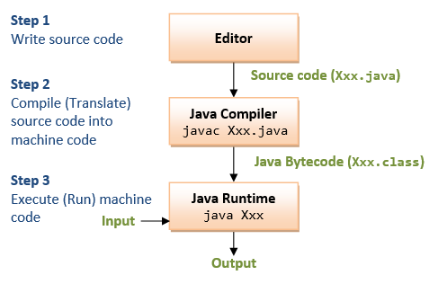

## *Estudos em Java!*

*O Java funciona por meio de uma Virtual Machine (JVM), o código feito pelo desenvolvedor (.java) é compilado atráves do javac para um arquivo bytecode (.class) e interpretado pela JVM para linguagem de máquina (0, 1).*